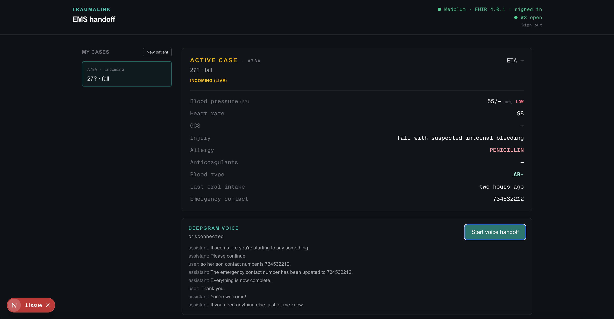
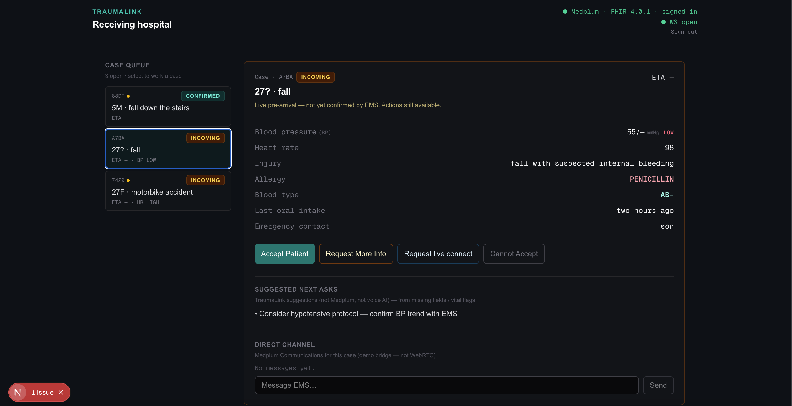
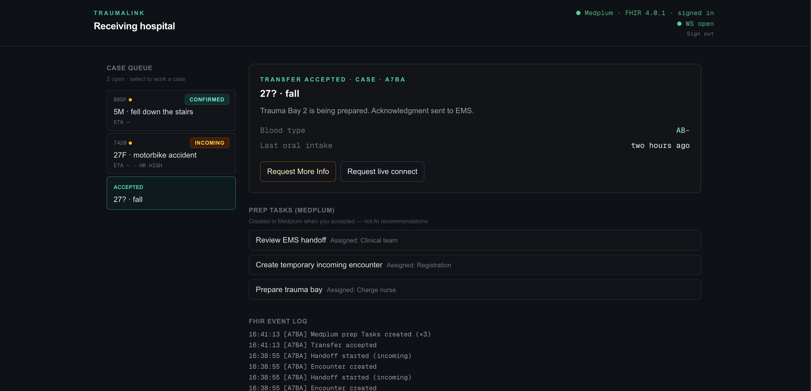

# TraumaLink

Live **pre-arrival trauma handoff** between EMS and the receiving hospital.

You speak a motorcycle trauma report on the EMS side; a structured trauma card fills in live. The hospital sees an **Incoming** case as soon as the call starts, can **Accept**, request more info by topic, and handle **multiple patients** at once. Live updates use Medplum FHIR + WebSockets; voice uses Deepgram Voice Agent.

| Route | Role |
|-------|------|
| [`/ems`](http://127.0.0.1:3000/ems) | Paramedic: voice/text → trauma card → Confirm |
| [`/hospital`](http://127.0.0.1:3000/hospital) | Trauma bay: case queue → Accept / Request info / channel |

**Glossary:** **BP** = blood pressure (systolic/diastolic mmHg), e.g. `92/60`.

---

## 1. What you need to prepare

### Accounts

1. **Medplum** — [https://app.medplum.com](https://app.medplum.com)
   - Project with a **Client Application** (Client ID)
   - Enable **websocket-subscriptions** on the project (required for live dual-browser updates)
   - A user email/password you can sign in with from the app
2. **Deepgram** — [https://console.deepgram.com](https://console.deepgram.com)
   - API key with **Member** permission or higher (needed for `POST /v1/auth/grant`)
   - Without this, voice fails; you can still demo with **Open Incoming** + **Load demo handoff** / text fallback

### Machine

- Node.js 20+ recommended
- npm
- Two browser windows (or one browser + one private window) for EMS + Hospital

---

## 2. Files you create / edit locally

Copy the env template and fill secrets (never commit `.env.local`):

```bash
cp .env.local.example .env.local
```

Edit **`.env.local`** so it looks like:

```env
NEXT_PUBLIC_MEDPLUM_BASE_URL=https://api.medplum.com/
NEXT_PUBLIC_MEDPLUM_CLIENT_ID=your-medplum-client-id-uuid
DEEPGRAM_API_KEY=your-deepgram-member-api-key
```

| Variable | Where it lives | Purpose |
|----------|----------------|---------|
| `NEXT_PUBLIC_MEDPLUM_BASE_URL` | `.env.local` | Medplum API host (usually cloud URL above) |
| `NEXT_PUBLIC_MEDPLUM_CLIENT_ID` | `.env.local` | Browser Medplum client app ID |
| `DEEPGRAM_API_KEY` | `.env.local` (server-only) | Mints short-lived JWTs via `/api/deepgram/token` |

Optional for submission: add PNGs under `docs/screenshots/` (see [Screenshots](#7-screenshots-for-submission)).

---

## 3. Commands to run

```bash
# From repo root
npm install

# Dev server (recommended bind for local demo)
npm run dev -- -H 127.0.0.1 -p 3000

# Optional checks
npm run build
npm run lint
```

After changing `.env.local`, **restart** `npm run dev` so Next.js reloads env.

---

## 4. How to run the project (demo flow)

1. Start the server (commands above). Open:
   - EMS: [http://127.0.0.1:3000/ems](http://127.0.0.1:3000/ems)
   - Hospital: [http://127.0.0.1:3000/hospital](http://127.0.0.1:3000/hospital)
2. Sign in on **both** with the same Medplum user. Header should show **WS open** (green). If **WS error**, enable websocket-subscriptions on the Medplum project.
3. **Hospital** starts with an empty case queue.
4. **EMS:** click **Start voice handoff** (or **Open Incoming card** without mic) → hospital gets an **Incoming** case.
5. Speak the report, or **Load demo handoff** / paste text → **Apply text to card**. Card fields update; hospital updates live.
6. EMS: **Confirm handoff** → hospital badge **Confirmed**.
7. Hospital: select the case → **Accept Patient** → Medplum prep tasks appear; EMS gets an acknowledgment (spoken if voice is connected).
8. Hospital: **Request More Info** → pick topics (blood type, oral intake, …) → EMS sees open asks / voice inject → answers update the card.
9. Optional: EMS **New patient** for a second concurrent case; either side **Request live connect** for a demo channel ping (not real WebRTC).

Home page [http://127.0.0.1:3000](http://127.0.0.1:3000) links to EMS and Hospital.

---

## 5. How it looks (UI map)

### EMS (`/ems`)

- **Left:** My cases list + **New patient**
- **Main:** Active trauma card (blood pressure, HR, GCS, injury, allergy, blood type, oral intake, …)
- Voice panel (Deepgram) + text fallback
- Direct channel + Confirm handoff
- Status: Incoming (live) vs Confirmed

### Hospital (`/hospital`)

- **Left:** Case queue (short ID, ETA, Incoming/Confirmed, acuity hints)
- **Main:** Selected case detail + actions (Accept, Request More Info, Request live connect)
- **Suggested next asks** — TraumaLink rules (missing fields / vital flags), *not* Medplum, *not* voice AI
- **Prep tasks (Medplum)** — created on Accept
- Direct channel + FHIR event log

### Visual direction

Dark clinical ops chrome (`#0c1117`), teal accents, amber for Incoming, monospace vitals — dual-browser “ops board,” not a marketing landing page.

---

## 6. Project structure — what each file does

```
handoff-zero/
├── .env.local.example          # Template for secrets (copy → .env.local)
├── .env.local                  # Your secrets (gitignored)
├── package.json                # Scripts + dependencies
├── next.config.ts              # Turbopack root pinned to this repo
├── README.md                   # This file
├── docs/
│   └── screenshots/            # Put submission PNGs here
│       └── README.md           # Filename checklist
└── src/
    ├── app/
    │   ├── layout.tsx          # Root HTML shell, fonts
    │   ├── page.tsx            # Home: links to /ems and /hospital
    │   ├── globals.css         # Tailwind / global styles
    │   ├── ems/page.tsx        # EMS multi-case UI + voice/text/confirm
    │   ├── hospital/page.tsx   # Hospital queue + case detail + actions
    │   └── api/
    │       ├── deepgram/token/route.ts   # Short-lived Deepgram JWT (keeps API key server-side)
    │       └── handoff/route.ts          # Legacy stub (writes happen in browser Medplum client)
    ├── components/
    │   ├── Providers.tsx       # Medplum provider, login, AuthGate, WS status badge, chrome
    │   ├── EtaCountdown.tsx    # Live ETA MM:SS from etaCapturedAt
    │   ├── TraumaCardFields.tsx # Shared vitals / injury / allergy rows
    │   └── VoiceHandoff.tsx    # Deepgram agent, function calling, inject on hospital events
    └── lib/
        ├── trauma.ts           # TraumaCard types, BP/flags, missing fields, text parse, case helpers
        └── fhir/handoff.ts     # FHIR Bundle builders, draft/confirm/patch, Accept, info/bridge/channel
```

### Data flow (short)

```
EMS speech/text → TraumaCard state → createDraft / patch / confirm (Medplum)
       ↓                                        ↓
Deepgram tools                          Hospital useSubscription
       ↓                                        ↓
Card updates live                      Queue + detail refresh
Hospital Accept / Request info → Communication / Task → EMS inject + card
```

---

## 7. Screenshots (for submission)

Create the folder if needed, then save images with **exactly** these names:

```bash
mkdir -p docs/screenshots
# then copy/save your captures as:
#   docs/screenshots/01-ems-incoming.png
#   docs/screenshots/02-hospital-queue.png
#   docs/screenshots/03-hospital-accept.png
#   docs/screenshots/04-request-info.png
#   docs/screenshots/05-dual-browser.png
```

| # | Filename | What to capture |
|---|----------|-----------------|
| 1 | `01-ems-incoming.png` | EMS active case: trauma card with **blood pressure** visible + voice (or text) panel |
| 2 | `02-hospital-queue.png` | Hospital queue with **2+ cases**, one selected |
| 3 | `03-hospital-accept.png` | After Accept: **Medplum prep tasks** + labeled TraumaLink suggestions |
| 4 | `04-request-info.png` | **Request More Info** topic picker open |
| 5 | `05-dual-browser.png` | Side-by-side EMS + Hospital (or wide crop of both) |

### Preview slots

Add the five files above — these markdown images will render on GitHub once the PNGs exist.

#### 1. EMS — Incoming trauma card



*Caption: EMS trauma card filling live (BP, vitals, missing fields).*

---

#### 2. Hospital — Multi-case queue



*Caption: Ops board with concurrent Incoming/Confirmed cases.*

---

#### 3. Hospital — Accept + prep tasks



*Caption: Accept creates Medplum Tasks; suggestions stay labeled as TraumaLink rules.*

---

#### 4. Request More Info picker


*Caption: Choosable topics (blood type, oral intake, …), not a single hard-coded ask.*

---

#### 5. Dual-browser demo


*Caption: End-to-end live handoff across EMS and hospital windows.*

---

## 8. Provenance (for judges)

| UI label | Source |
|----------|--------|
| Prep tasks | Medplum `Task` resources created on Accept |
| Suggested next asks | TraumaLink client rules (`getMissingFields` + vital flags) |
| Voice extraction | Deepgram Voice Agent function calling |
| Live dual-browser updates | Medplum `useSubscription` (WebSocket) |
| Direct connect | Medplum `Communication` ping/thread (demo — not WebRTC/SIP) |

---

## License / hackathon note

Built for a Medplum + Deepgram hackathon demo. Secrets stay in `.env.local`; Deepgram keys never ship to the browser (JWT grant only).
